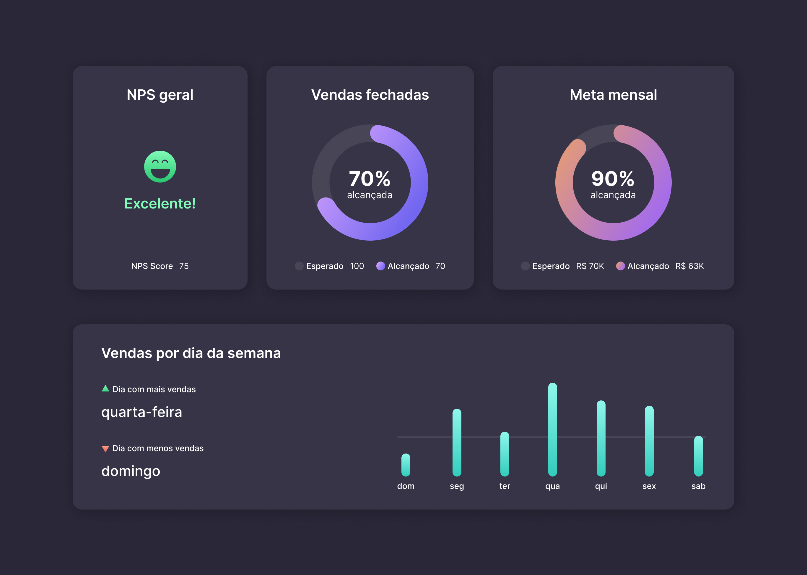

<h1> Boarding pass </h1>

 

<h2> O Projeto </h2>

O projeto Dashboard foi desenvolvido durante os desafios do #BoraCodar da Rocketseat. O #boraCodar são desafios semanais, promovido pela Rocketseat para ensino de tecnologias WEB. 

O desafio foi a criação de um dashboard de vendas onde na Página inicial, é mostrado os indicadores em cada card, especificando a métrica e seu resultado em um gráfico.  

  

 

Quer conferir como ficou o bording pass? 

[Visite o projeto online](https://eltonprado.github.io/BoraCodar_Desafio08_Dashboard/)

 

<h2> O intuito do projeto </h2>

O intuito do projeto foi colocar em prática os conhecimentos acerca de:

### CSS

- aplicar variável pelo atributo HTML
- animations / @keyframes
- column-gap / row-gap
- grid-template-columns / grid-template-rows / grid-column / grid-auto-flow
- fit-content
- margin-top: auto
- place-content / align-self / justify-items / justify-content
- centralizar div com position/grid/flex/margin
- :nth-child() / ::before
- transform / matrix() / rotate()
- stroke / dasharray / dashoffset / stroke-width / linecap
- fill
- responsividade / mobile first / @media
- clip-path / polygon
- linear-gradient()
- calc()

### SVG

- viewBox
- circle
- cx / cy
- r
- stroke
- defs
- linearGradient

 

<h2> Tecnologias </h2>

Foi utilizado as seguintes tecnologias para desenvolver esse projeto:

- HTML
- CSS
- figma
- Git
- GitHub
- https://bennettfeely.com/clippy/
